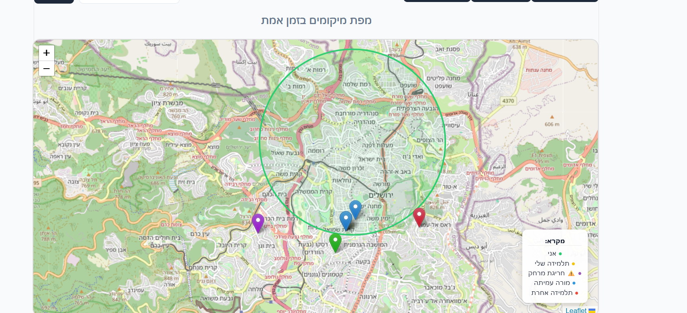
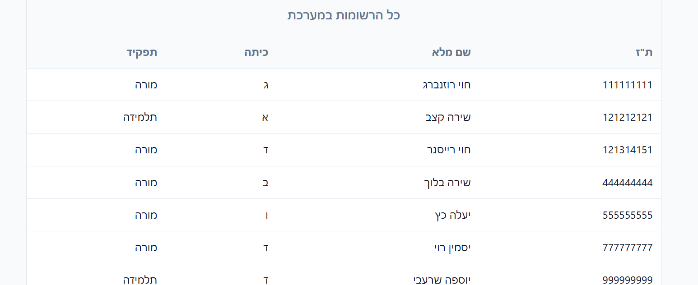
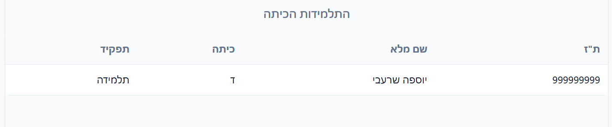
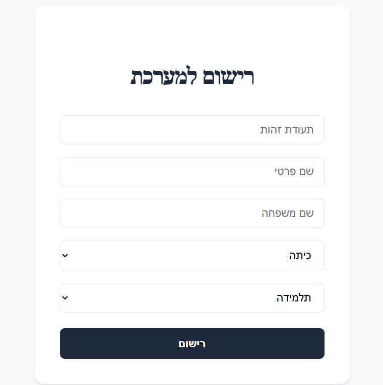

#מערכת לניהול טיול שנתי של בית ספר 
מערכת FULL-STACK שמאפשרת רשימת מורות ותלמידות כולל איכון בזמן אמת על המפה

#טכנולוגיות
 Frontend: React, Leaflet (Maps)
 Backend: Node.js
 Database:MySQL

#התקנה והרצה
הורדת הפרוייקט מהגיט
הורדת התוכנה MYSQL WORKBENCH וייבוא קובץ הINITֹDB להריץ
להריץ בטרמינל דרך תקיית הBACKENDB =NODE SERVER.JS
להריץ בטרמינל דרך תקיית הפרונטד NPM RUN DEV
להכנס לקישור מהטרמינל ולהנות מהמערכת

#טכנולוגיות מרכזיות
המרת קורדינטות מDMS לעשרוני
תצוגה ויזואלית של כל התלמידים עם מיקומים
התראה אוטומטית אם תלמיד מתרחק מעל ל3 קמ מהמורה שלו
המפה והנתונים נגישים רק למורים

#צילומי מסך והסבר:

